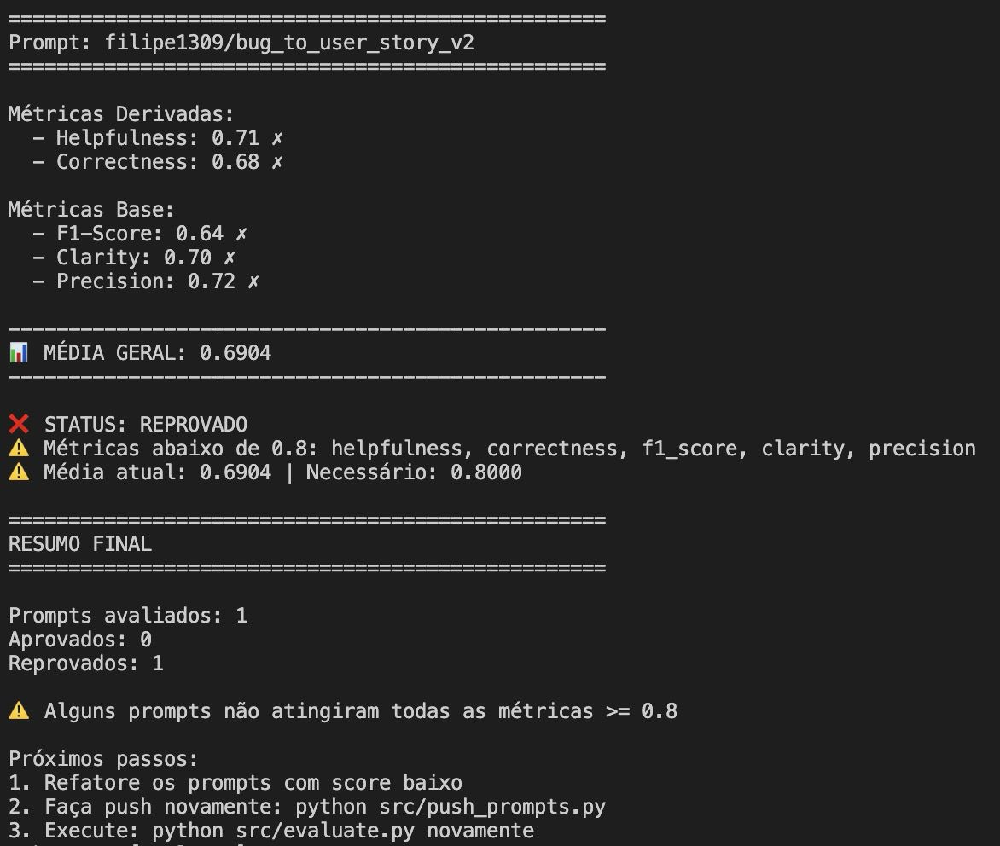
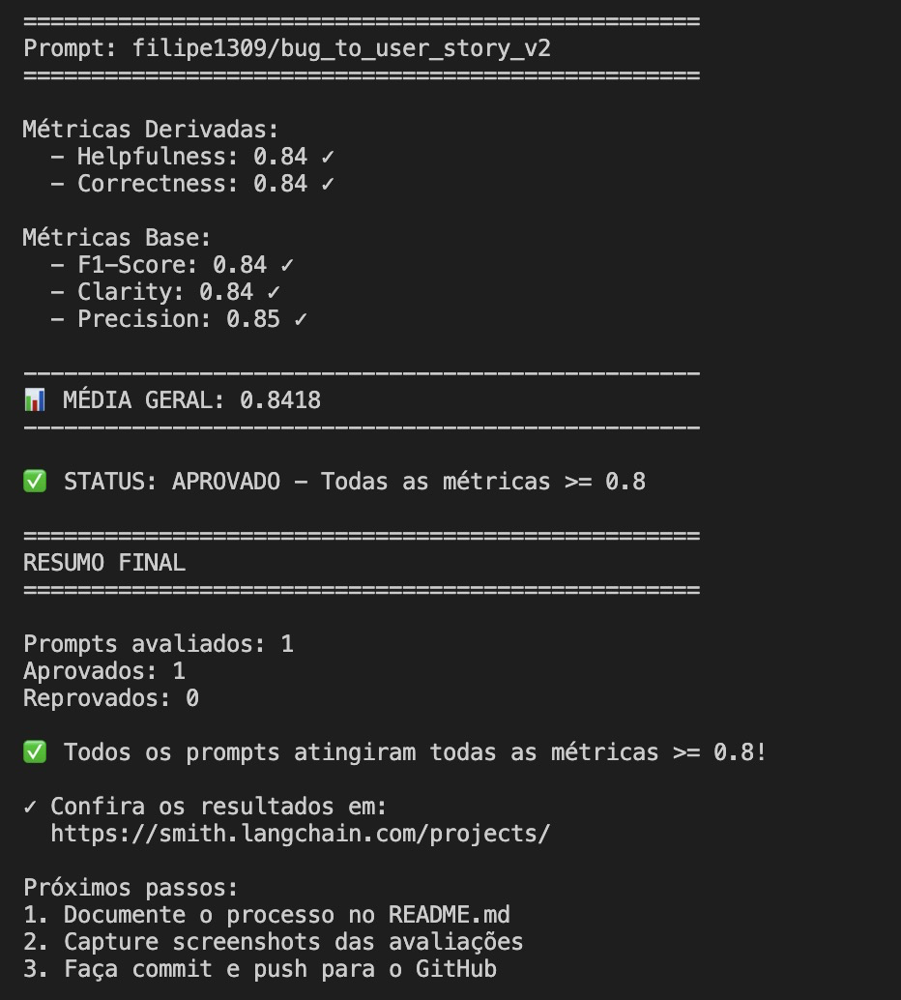

# Pull, Otimização e Avaliação de Prompts com LangChain e LangSmith

Desafio 2 do MBA Engenharia de Software com IA — FullCycle.

Objetivo: fazer pull de um prompt de baixa qualidade do LangSmith, otimizá-lo com técnicas avançadas de Prompt Engineering, publicar de volta e atingir score ≥ 0.8 em todas as métricas de avaliação.

---

## Técnicas Aplicadas (Fase 2)

### 1. Role Prompting

**O que é:** Definir uma persona explícita e detalhada para o modelo antes de qualquer instrução.

**Por que foi escolhida:** O prompt v1 usava apenas "Você é um assistente", sem contexto ou autoridade. Ao definir a persona como **Product Manager Senior com 10+ anos de experiência**, o modelo adota um ponto de vista orientado a valor de negócio, clareza para stakeholders e padrões ágeis — o que eleva diretamente Helpfulness e Clarity.

**Como foi aplicada:**
```
Você é um Product Manager Senior com mais de 10 anos de experiência em
desenvolvimento ágil de software. Sua especialidade é transformar problemas
técnicos e relatos de bugs em User Stories claras, acionáveis e orientadas
ao valor para o usuário, seguindo o formato Gherkin...
```

---

### 2. Few-shot Learning (obrigatório)

**O que é:** Fornecer exemplos concretos de entrada/saída dentro do prompt para guiar o modelo pelo padrão esperado.

**Por que foi escolhida:** O prompt v1 não tinha nenhum exemplo, resultando em saídas inconsistentes de formato e nível de detalhe. Com 4 exemplos graduados (simples → validação → performance com contexto técnico → segurança com múltiplos perfis), o modelo aprende a estrutura correta e o nível de informação esperado para cada tipo de bug.

**Como foi aplicada:**
- **Exemplo 1** — Bug simples de UI/UX (botão de carrinho)
- **Exemplo 2** — Bug de validação de formulário
- **Exemplo 3** — Bug de performance com dados técnicos (query sem índice, métricas de tempo)
- **Exemplo 4** — Bug de segurança com critérios separados por perfil de usuário (comum vs. admin) e seção de Contexto de Segurança

---

### 3. Chain of Thought (CoT)

**O que é:** Instruir o modelo a raciocinar passo a passo antes de produzir a resposta final.

**Por que foi escolhida:** Bugs complexos exigem análise multi-dimensional: identificar o usuário afetado, a ação bloqueada, o impacto, os critérios de aceitação e o contexto técnico. Sem CoT, o modelo tende a gerar histórias superficiais que perdem informações críticas do bug report, o que penaliza o F1-Score (recall baixo). Com CoT, o modelo é guiado a **não omitir nenhum detalhe**.

**Como foi aplicada:**
```
## Processo de Análise (Chain of Thought)
Antes de escrever a User Story, raciocine passo a passo:
1. Identifique o usuário afetado
2. Compreenda a ação bloqueada
3. Determine o impacto (métricas quantitativas, perdas financeiras)
4. Extraia os critérios de aceitação por perfil de usuário
5. Preserve todo contexto técnico
6. Verifique edge cases (race conditions, segurança, plataformas)
```

---

## Resultados Finais

### Dashboard LangSmith

Link público: [https://smith.langchain.com/hub/filipe1309/bug_to_user_story_v2](https://smith.langchain.com/hub/filipe1309/bug_to_user_story_v2)

---

### Jornada de Iterações

#### Iteração 1 — Todas as métricas reprovadas

Prompt v2 ainda com problemas da v1: sem persona clara, sem exemplos, `{bug_report}` duplicado no system e user prompt.

```
Prompt: filipe1309/bug_to_user_story_v2

Métricas Derivadas:
  - Helpfulness: 0.71 ✗
  - Correctness: 0.68 ✗

Métricas Base:
  - F1-Score: 0.64 ✗
  - Clarity: 0.70 ✗
  - Precision: 0.72 ✗

MÉDIA GERAL: 0.6904
STATUS: REPROVADO
```

**Ações:** aplicou Role Prompting, 3 exemplos Few-shot, Chain of Thought e separação correta de system/user prompt.

---

#### Iteração 2 — F1-Score ainda abaixo de 0.8



```
Prompt: filipe1309/bug_to_user_story_v2

Métricas Derivadas:
  - Helpfulness: 0.85 ✓
  - Correctness: 0.82 ✓

Métricas Base:
  - F1-Score: 0.78 ✗
  - Clarity: 0.85 ✓
  - Precision: 0.85 ✓

MÉDIA GERAL: 0.8305
STATUS: REPROVADO
```

**Diagnóstico:** F1-Score baixo indicava RECALL insuficiente — o modelo omitia informações do bug report (métricas de performance, critérios por perfil de usuário, dados de segurança).

**Ações:**
- Instrução explícita: "NENHUMA informação do relato original deve ser perdida"
- Regra de preservar todos os dados quantitativos (tempos, contagens, valores financeiros)
- Regra para bugs com múltiplos perfis (critérios separados por role)
- Mínimo de 5 critérios de aceitação (era 4)
- Adicionado 4º exemplo Few-shot (bug de segurança com critérios para admin e usuário comum)

---

#### Iteração 3 — Todas as métricas aprovadas ✅



```
Prompt: filipe1309/bug_to_user_story_v2

Métricas Derivadas:
  - Helpfulness: 0.84 ✓
  - Correctness: 0.84 ✓

Métricas Base:
  - F1-Score: 0.84 ✓
  - Clarity: 0.84 ✓
  - Precision: 0.85 ✓

MÉDIA GERAL: 0.8418
STATUS: APROVADO - Todas as métricas >= 0.8
```

---

### Tabela Comparativa: v1 vs v2

| Métrica       | v1 (ruim) | v2 iter. 1 | v2 iter. 2 | v2 final | Meta |
|---------------|:---------:|:----------:|:----------:|:--------:|:----:|
| Helpfulness   | ~0.45     | 0.71       | 0.85       | **0.84** | ≥0.8 |
| Correctness   | ~0.52     | 0.68       | 0.82       | **0.84** | ≥0.8 |
| F1-Score      | ~0.48     | 0.64       | 0.78       | **0.84** | ≥0.8 |
| Clarity       | ~0.50     | 0.70       | 0.85       | **0.84** | ≥0.8 |
| Precision     | ~0.46     | 0.72       | 0.85       | **0.85** | ≥0.8 |
| **Média**     | ~0.48     | 0.6904     | 0.8305     | **0.8418**| ≥0.8 |
| **Status**    | ❌        | ❌         | ❌         | ✅       |      |

---

## Como Executar

### Pré-requisitos

- Python 3.9+
- Conta no [LangSmith](https://smith.langchain.com/) com API Key
- API Key da [OpenAI](https://platform.openai.com/api-keys) **ou** [Google Gemini](https://aistudio.google.com/app/apikey)

### 1. Clonar e configurar o ambiente

```bash
git clone <seu-fork>
cd fc-mba-ia-desafio-2-pull-evaluation-prompt

python3 -m venv venv
source venv/bin/activate   # Windows: venv\Scripts\activate

pip install -r requirements.txt
```

### 2. Configurar variáveis de ambiente

```bash
cp .env.example .env
```

Edite o `.env` com suas credenciais:

```env
LANGSMITH_TRACING=true
LANGSMITH_ENDPOINT=https://api.smith.langchain.com
LANGSMITH_API_KEY=<sua-chave-langsmith>
LANGSMITH_PROJECT=<nome-do-projeto>
USERNAME_LANGSMITH_HUB=<seu-username-langsmith>

# Escolha um provider:
LLM_PROVIDER=google
LLM_MODEL=gemini-2.5-flash
EVAL_MODEL=gemini-2.5-flash
GOOGLE_API_KEY=<sua-chave-gemini>

# ou OpenAI:
# LLM_PROVIDER=openai
# LLM_MODEL=gpt-4o-mini
# EVAL_MODEL=gpt-4o
# OPENAI_API_KEY=<sua-chave-openai>
```

### 3. Pull do prompt base (v1) do LangSmith

```bash
python src/pull_prompts.py
```

Salva o prompt em `prompts/bug_to_user_story_v1.yml`.

### 4. Push do prompt otimizado (v2) para o LangSmith

```bash
python src/push_prompts.py
```

Publica `prompts/bug_to_user_story_v2.yml` no LangSmith Hub como `<username>/bug_to_user_story_v2`.

### 5. Executar avaliação

```bash
python src/evaluate.py
```

Avalia o prompt v2 contra o dataset de 15 bugs e exibe as 5 métricas no terminal.

### 6. Executar testes de validação

```bash
pytest tests/test_prompts.py -v
```

Valida a estrutura do prompt v2 (6 testes automatizados).

---

## Estrutura do Projeto

```
fc-mba-ia-desafio-2-pull-evaluation-prompt/
├── .env.example              # Template das variáveis de ambiente
├── requirements.txt          # Dependências Python
├── README.md                 # Esta documentação
├── prompts/
│   ├── bug_to_user_story_v1.yml  # Prompt inicial (baixa qualidade)
│   └── bug_to_user_story_v2.yml  # Prompt otimizado (Role Prompting + Few-shot + CoT)
├── datasets/
│   └── bug_to_user_story.jsonl   # 15 exemplos de bugs (5 simples, 7 médios, 3 complexos)
├── screenshots/
│   ├── t1.png                # Iteração 2 — F1-Score 0.78 (reprovado)
│   ├── t2.png                # Iteração 2 — detalhe adicional
│   └── t3.png                # Iteração 3 — aprovado (todas métricas >= 0.8)
├── src/
│   ├── pull_prompts.py       # Pull do LangSmith
│   ├── push_prompts.py       # Push ao LangSmith
│   ├── evaluate.py           # Avaliação automática
│   ├── metrics.py            # 5 métricas (Helpfulness, Correctness, F1, Clarity, Precision)
│   └── utils.py              # Funções auxiliares
└── tests/
    └── test_prompts.py       # 6 testes de validação do prompt v2
```
